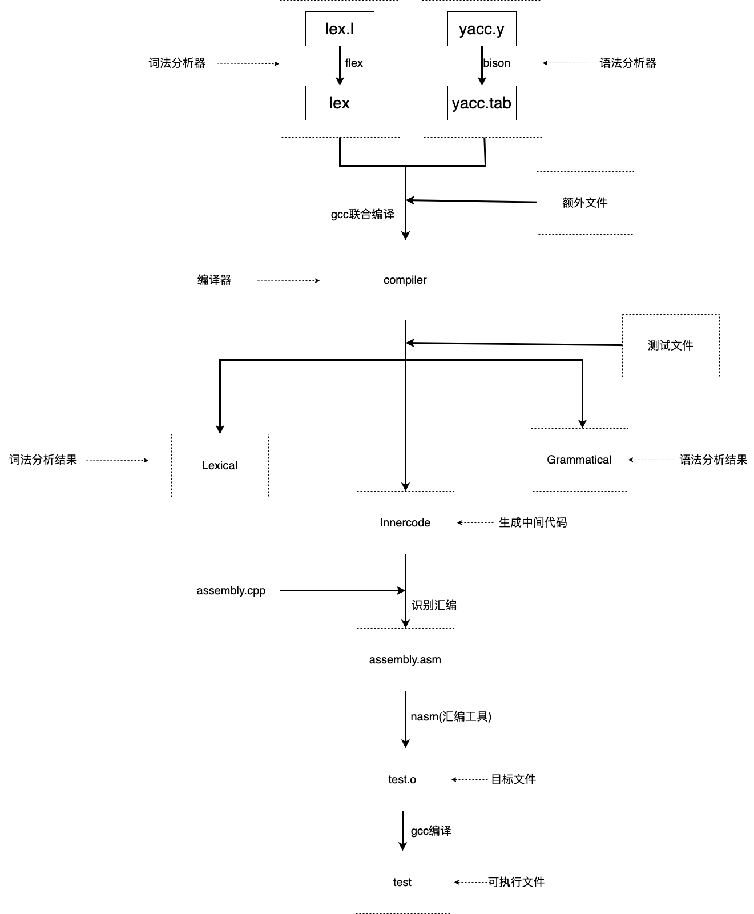

# 简单C语言编译器
项目地址：https://github.com/NTMRWSB/Simple-C-Compiler
### 一、实验介绍  
本实验是南京信息工程大学编译原理课程实践课大作业，要求实现一个简易的C语言编译器，主要内容包括：
#### 基本功能：
- [x] 词法分析 20分
- [x] 语法分析（构建语法树）40分
- [x] 中间代码生成（如四元式）10分
- [x] 类型检查 20分。  

#### 附加功能：
- [x] 代码优化 5分
- [x] 错误分析 5分
- [x] 汇编程序 10分

### 二、实验要求

#### 	1.基本要求：

- 变量类型：int
- 语句：注释，声明，赋值，循环（while和for），判断（if），输入输出
- 算术运算：+，-，*，/，%，^
- 关系运算：==，<，>，<=，>=，!=
- 逻辑运算：&&（与），||（或），!（非）

#### 	2.拓展功能

- 支持过程和函数调用
- 支持数组运算
- 支持指针运算
- 支持结构体

### 三、小组成员及分工

- 202083290503 胡天乐（词法，汇编）
- 202083290374 刘辉（词法，语法）
- 202083290153 王子荀（语法，测试）
- 202083290400 鲁哲豪（语法，中间代码）

### 四、实验内容

#### 0.环境准备及使用说明

​Windows WSL2.0（Ubuntu）或 Ubuntu22.04.1，请不要在ARM平台下编译该项目，可能出现意想不到的错误
#### 安装必要的编译组件：
```
sudo apt install build-essential
```
#### 安装FLEX&BISON以及NASM：
```
sudo apt install flex bison nasm
```
#### 安装CMAKE：
```
sudo apt install cmake
```
#### ​在文件根目录下运行：
```
make //默认文件名为test
```
或
```
make file=<filename> 	//filename指要编译的c语言代码文件，默认文件名为test
```
分析结果在当前目录下

词法分析：`Lexical`

语法分析：`Grammatical`

中间代码：`InnerCode`

汇编代码：`assembly.asm`

可执行文件：`<filename>`

**项目架构图**



_____
#### 1.词法分析

​	经过调研与选型，我们决定使用lex作为词法分析器。通过词法分析器，生成源代码相应的词法分析文件。

​	部分类型说明：

| 词素                 | 词法单元       | 介绍                 |
| -------------------- | -------------- | :------------------- |
| return               | RET            | 返回                 |
| if/while/for         | IF/WHILE/FOR   | 判断及两种循环标识符 |
| break/continue       | BREAK/CONTINUE | 流程控制             |
| int                  | INT            | 整型变量             |
| input_int/output_int | INPUT/OUTPUT   | 输入输出             |
| id                   | ID             | 变量名               |
| + - * /              | + - * /        | 四则运算符           |
| % ^                  | % ^            | 模运算及乘方运算符   |
| && \|\|  ！          | AND/OR/NOT     | 逻辑运算符           |

词法分析结果:

```
单词         	词素         	属性
INT            	int            
MAIN           	main           
LP             	(              
RP             	)              
LCB            	{              
INT            	int            
ID             	a              0x5604106792a0
ASSIGN         	=              
INT10          	8              8
SEMICOLON      	;              
INT            	int            
ID             	b              0x5604106792a0
ASSIGN         	=              
INT10          	10             10
SEMICOLON      	;              
IF             	if             
LP             	(              
ID             	a              0x5604106792a0
EQ             	==             
INT10          	8              8
RP             	)              
LCB            	{              
OUTPUT         	output_int     
LP             	(              
ID             	a              0x5604106792a0
RP             	)              
SEMICOLON      	;              
RCB            	}              
INT            	int            
ID             	i              0x5604106792a0
ASSIGN         	=              
INT10          	2              2
SEMICOLON      	;              
FOR            	for            
LP             	(              
SEMICOLON      	;              
ID             	i              0x5604106792a0
LT             	<              
INT10          	3              3
SEMICOLON      	;              
ID             	i              0x5604106792a0
ASSIGN         	=              
ID             	i              0x5604106792a0
ADD            	+              
INT10          	1              1
RP             	)              
LCB            	{              
OUTPUT         	output_int     
LP             	(              
ID             	b              0x5604106792a0
RP             	)              
SEMICOLON      	;              
RCB            	}              
INT            	int            
ID             	c              0x5604106792a0
ASSIGN         	=              
ID             	b              0x5604106792a0
MOD            	%              
ID             	a              0x5604106792a0
SEMICOLON      	;              
OUTPUT         	output_int     
LP             	(              
ID             	c              0x5604106792a0
RP             	)              
SEMICOLON      	;              
INT            	int            
ID             	d              0x5604106792a0
ASSIGN         	=              
INT10          	5              5
POW            	^              
INT10          	2              2
SEMICOLON      	;              
OUTPUT         	output_int     
LP             	(              
ID             	d              0x5604106792a0
RP             	)              
SEMICOLON      	;              
RETURN         	return         
INT10          	0              0
SEMICOLON      	;              
RCB            	}              

```
#### 2.语法分析

​使用yacc接受lex产生的token，并对程序的语法进行语法分析，最终打印出抽象语法树。

##### 	部分语句文法:

```c
//if语句文法
//设置优先级解决移入-归约冲突
%precedence ')'
%precedence ELSE
......
......
if_expression 
    : if_identifier ')' statement
    | if_identifier ')' statement ELSE statement
;
if_identifier
    : IF  '(' operate_expression
;
```

```c
//for语句文法
for_expression
    : FOR '(' nullable_expression ';'  nullable_expression ';' nullable_expression ')' statement
;
```

```c
//while文法
while_expression
    : WHILE '(' operate_expression ')' statement
;
```

##### 	语法树构造:

​	使用n叉树来构造抽象语法树。

```c
//语法树数据结构
typedef struct Tree{
    char* content;				//词素
    char* name;					//名字
    int line;					//行号
    int num;					//子节点数量
    int headline;				//语句段起始行号
    int nextline;				//下一个语句段行号
    char* inner;				//存储中间变量
    char* code;					//中间代码
    struct Tree** leaves;		//叶子节点
    struct Tree* next;			//链表指针
    struct Declator* declator;	//修饰符
}Tree;
```

```c
//初始化树
Tree* initTree(int num);
//创建树
Tree* createTree(char* name, int number, ...);
//在lex文件里创建终结符节点
Tree* terminator(char* name, int yylineno);
//二元运算符创建树
Tree* binaryOpr(char* name, Tree* t1, Tree* t2, Tree* t3);
//赋值运算符创建树
Tree* assignOpr(char* name, Tree* t1, Tree* t2, Tree* t3);
//一元运算符创建树
Tree* unaryOpr(char* name, Tree* t1, Tree* t2);
//if语句创建树
Tree* ifOpr(char* name,int headline,int nextline,Tree* op,Tree* stmt);
//if-else语句创建树
Tree* ifelseOpr(char* name, int headline, int next1, int next2, Tree* op, Tree* stmt1, Tree* stmt2);
//while语句创建树
Tree* whileOpr(char* name,int head1, int head2,int nextline,Tree* op,Tree* stmt);
//for语句创建树
Tree* forOpr(char* name,int head1, int head2, int nextline, Tree* op1, Tree* op2, Tree* op3, Tree* stmt);
Tree* retNull(char* name,Tree* ret);
Tree* retOpr(char* name,Tree* ret,Tree* op);
//输入输出函数创建树
Tree* unaryFunc(char* name,Tree* func, Tree* op);
// 添加修饰符
Tree* addDeclator(char* name, Tree* t1, Tree* t2);
//打印树
void printTree(Tree* tree);
//释放树指针
void freeTree(Tree* tree);
```

```c
//语法树创建函数
Tree* createTree(char* name, int number, ...){		//c语言可变长参数
    int i;
    va_list valist;
    va_start(valist, number);
    if(number == 1){
        return va_arg(valist, Tree*);
    }
    Tree* tree = initTree(1);
    if(!tree){
        printf("Out of space \n");
        exit(0);
    }
    tree->num = number;
    int len = strlen(name);
    tree->name = (char*)malloc(len + 1);
    memcpy(tree->name, name, len + 1);
    char *str= (char*)malloc(MAX);
    tree->leaves = (Tree**)malloc(sizeof(Tree*)*number);
    for(i = 0; i < number; i++){
        tree->leaves[i] = va_arg(valist, Tree*);	//创建叶子节点
        if(tree->leaves[i]->code)
            strcat(str,tree->leaves[i]->code);		//初始化叶子节点并合并中间代码
    }
    if(strlen(str)>0)
        tree->code = str;
    return tree;
}
```

​	语法树示例：

```
Main Func
    INT int
    MAIN main
    LP (
    RP )
    LCB {
    sentence
        declare_expression
            INT int
            assignment_expression =
                ID a
                INT10 8
        sentence
            declare_expression
                INT int
                assignment_expression =
                    ID b
                    INT10 10
            sentence
                if_expression
                    equality_expression ==
                        ID a
                        INT10 8
                    statement
                        LCB {
                        output
                            OUTPUT output_int
                            ID a
                        RCB }
                sentence
                    declare_expression
                        INT int
                        assignment_expression =
                            ID i
                            INT10 2
                    sentence
                        for_expression
                            null
                            relational_expression <
                                ID i
                                INT10 3
                            assignment_expression =
                                ID i
                                additive_expression +
                                    ID i
                                    INT10 1
                        sentence
                            declare_expression
                                INT int
                                assignment_expression =
                                    ID c
                                    multiplicative_expression %
                                        ID b
                                        ID a
                            sentence
                                output
                                    OUTPUT output_int
                                    ID c
                                sentence
                                    declare_expression
                                        INT int
                                        assignment_expression =
                                            ID d
                                            multiplicative_expression ^
                                                INT10 5
                                                INT10 2
                                    sentence
                                        output
                                            OUTPUT output_int
                                            ID d
                                        return_expression
                                            RETURN return
                                            INT10 0
    RCB }

```


##### 	符号表创建:

​		为提高存取效率，我们将原本的链表结构的符号表进行了修改，改用链式哈希表实现。也便于就解决变量重定义和作用域问题。

```c
typedef struct Declator{    //修饰符(array or pointer)
    int type;
    struct Tree* length;
    struct Declator* next;
}Declator;

typedef struct Data{
    char* id_name;  	//变量名 
    int type;       	//变量类型
    void* adress;    	//存储地址
    int size;			//大小
    int scope;      	//作用域
    struct Declator* declator;
}Data;

typedef struct HashNode{
    Data* data;
    struct HashNode* next;
}HashNode;

typedef struct HashMap{
    int size;
    HashNode** hash_table;
}HashMap;
```

```c
//Hash Function
unsigned int RSHash(const char* str, unsigned int len);
//创建哈希表
HashMap* createHashMap(int size);
//变量转化为data类型
Data* toData(int type, char* str, struct Declator* declator, int scope);
//释放节点
void freeHashNode(HashNode* hashNode);
//分配内存
void getSize(HashNode* hashNode);
//创建哈希节点
HashNode* createHashNode(Data* data);
//add data to hashMap
HashNode* put(HashMap* hashMap, Data* data);
//将树中的变量存入符号表中
void putTree(HashMap* hashMap, struct Tree *tree);
//find data in hashMap, return NULL when error
HashNode* get(HashMap* hashMap, Data* data);
//语句块退出时销毁当前块符号表
void destoryPartOfHashMap(HashMap* hashMap, int scope);
void destoryHashMap(HashMap* hashMap);
```

##### 中间代码生成:

​	根据抽象语法树生成中间代码。产生时，子节点的中间代码依次向上合并，最终在根节点产生出完整的中间代码。

```c
typedef struct Node{
    char* inner;	//中间代码变量
    char* op;		//存储算符
    char** var;		//存储多个变量名
    int num;		//存储变量个数（子节点个数）
    struct Node* next;
}Node;

//获取双目运算中间代码
struct Node* getNodeByDoubleVar(char* op, char* var0, char* var1,int inner_count);
//获取单目运算中间代码
struct Node* getNodeBySingleVar(char* op, char* var,int inner_count);
//拼接多个字符串
char* mergeCode(int num, ...);
//生成行号
char* lineToString(int number);
//int转换为char*
char* toString(int number);
//替换字符串
int swap(char *text, char *a, char *b);
```

```c
/*
	获取双目运算符的中间代码
	在链表中寻找相同的运算
	若运算已存在，则直接返回中间代码变量，无需生成
	若不存在，则创建新的中间代码变量，并向列表中插入该运算的信息
*/
Node* getNodeByDoubleVar(char* op, char* var0, char* var1,int inner_count){
    Node *p = head;
    while (p)
    {
        if (p->num = 2 && !strcmp(p->var[0],var0) && !strcmp(p->var[1],var1) && !strcmp(p->op,op))
        {
            Node *new_node = (Node*)malloc(sizeof(Node));
            new_node->op = NULL;
            new_node->inner = p->inner;
            return new_node;//返回相同的中间代码指针
        }
        p=p->next;
    }
    Node *new_node = (Node*)malloc(sizeof(Node));
    new_node->var = (char**)malloc(sizeof(char*)*2);//二目运算符
    new_node->inner = (char*)malloc(20);//中间代码最高20位
    new_node->num = 2;
    sprintf(new_node->inner,"t%d",inner_count++);
    
    new_node->var[0] = (char*)malloc(strlen(var0)+1);
    new_node->var[1] = (char*)malloc(strlen(var1)+1);
    new_node->op = (char*)malloc(strlen(op)+1);
    
    memcpy(new_node->var[0], var0, strlen(var0)+1);
    memcpy(new_node->var[1], var1, strlen(var1)+1);
    memcpy(new_node->op, op, strlen(op)+1);

    if(head){
        new_node->next = head;
    }
        
    head = new_node;
    return head;
}
```

​	中间代码运行结果:

```
1: a = 8
2: b = 10
3: t1 = a == 8
4: if t1 goto 6
5: goto 8
6: arg a
7: call output
8: i = 2
9: t2 = i < 3
10: if t2 goto 12
11: goto 17
12: arg b
13: call output
14: t3 = i + 1
15: i = t3
16: goto 9
17: t4 = b % a
18: c = t4
19: arg c
20: call output
21: t5 = 5 ^ 2
22: d = t5
23: arg d
24: call output
25: return 0

```

#### 3.类型检查:

​	由于该编译器目前只支持int型变量，无需进行类型检查，遂跳过。

#### 4.代码优化:

​	在生成中间代码的过程中，我们逐步进行了中间代码格式的优化。例如，生成中间代码时会寻找过去是否已经生成了相同运算的中间代码，可以减少部分不必要的代码。

#### 5.错误分析:

​	错误分析部分包括以下内容：

- lex文件中实现了词素无法匹配的问题。
- yacc文件中实现了在读入源程序时的代码匹配问题，产生错误时会返回行号。
- 符号表的实现解决了变量的重定义和未定义问题。

#### 6.汇编程序:

​	读取生成的中间代码文件，产生相应的nasm64位汇编。

​	实现思路：

​1.根据中间代码插入相应的四元组向量。

```
// 1 打开Innercode文件
  ifstream ifile("Innercode");  // 读名为Innercode的文件
  if (!ifile) {
    cout << "找不到名为Innercode的文件！" << endl;
    return 1;  // 非正常退出
  }

  // 2 根据Innercode创建四元组向量
  string line;  // line用于读取Innercode中的每一行
  while (getline(ifile, line)) {
    // cout << line << endl;
    // 2.1 读入一行，替换此行所有换行符（这个方法是在algorithm头文件里）
    line.erase(remove(line.begin(), line.end(), '\n'), line.end());

    // 2.2 按空格分割此行的内容，放入临时变量wds里
    vector<string> wds;        // wds=words，储存语句的内容
    stringstream input(line);  // 读取str到字符串流中
    string temp;
    while (getline(input, temp, ' ')) {
      wds.push_back(temp);
    }

    // 2.3 判断类型并插入四元组向量
    if (wds[1] == "if")  // 若相等compare返回0
      quad.push_back({"j==", wds[2], "1", wds[4]});
    else if (wds[1] == "goto")
      quad.push_back({"j", "_", "_", wds[2]});
    else if (wds[1] == "arg" || wds[1] == "call")
      quad.push_back({wds[1], "_", "_", wds[2]});
    else if (wds[1] == "return")
      quad.push_back({"ret", "_", "_", wds[2]});
    else if (wds.size() > 3 && wds[3] == "!")
      quad.push_back({"!", wds[4], "_", wds[1]});
    else if (wds[1][0] == 't')
      quad.push_back({wds[4], wds[3], wds[5], wds[1]});
    else
      quad.push_back({wds[2], wds[3], "_", wds[1]});
  }
```

​2.根据四元式的操作符类型生成相应的代码块和汇编代码。

```
// 3 为所有转移（j==与j）记录CODE位置
  int n = 0;
  set<int> t;
  for (auto element : quad) {
    if (element.s0[0] == 'j') {  // 如果是条件转移"j=="或无条件转移"j"
      t.insert(n);
      t.insert(stoi(element.s3) - 1);
    }
    ++n;
  }
  int m = 0;
  map<int, string> quad_in;
  for (int it : t) {
    quad_in[it] = "CODE" + to_string(++m);
  }

  // 4 创建assembly.asm文件，写入固定内容[1]
  ofstream ofile("assembly.asm", fstream::out);
  string tab = "        ";  // 默认的缩进（8空格）
  string inx = "[rbp-";
  ofile << "extern printf, scanf" << endl
        << "global main" << endl
        << "main:" << endl
        << tab + "enter 100, 0" << endl;

  // 5 写入实际的汇编内容
  vector<string> data;
  for (int i = 0; i < 100; ++i) data.push_back(emptystr);
  vector<string> judge = {">", "<", "==", ">=", "<=", "!="};
  for (int i = 0; i < quad.size(); ++i) {
    if (quad_in.count(i)) ofile << quad_in[i] + ":" << endl;
    if (quad[i].s0 == "j==") {  // 条件转移，则需要记录条件
      if (isInVector(judge, quad[i - 1].s0)) {
        if (isNumber(quad[i - 1].s1))
          ofile << tab + "mov eax," + quad[i - 1].s1 << endl;
        else
          ofile << tab + "mov eax," + inx
                << to_string(indexV(data, quad[i - 1].s1) * 4 + 4) + "]"
                << endl;
        if (isNumber(quad[i - 1].s2))
          ofile << tab + "mov ebx," + quad[i - 1].s2 << endl;
        else
          ofile << tab + "mov ebx," + inx
                << to_string(indexV(data, quad[i - 1].s2) * 4 + 4) + "]"
                << endl;
        ofile << tab + "cmp eax,ebx" << endl;
        if (quad[i - 1].s0 == ">")
          ofile << tab + "" + "ja" + " " + quad_in[stoi(quad[i].s3) - 1]
                << endl;
        else if (quad[i - 1].s0 == "<")
          ofile << tab + "" + "jb" + " " + quad_in[stoi(quad[i].s3) - 1]
                << endl;
        else if (quad[i - 1].s0 == ">=")
          ofile << tab + "" + "jae" + " " + quad_in[stoi(quad[i].s3) - 1]
                << endl;
        else if (quad[i - 1].s0 == "<=")
          ofile << tab + "" + "jbe" + " " + quad_in[stoi(quad[i].s3) - 1]
                << endl;
        else if (quad[i - 1].s0 == "==")
          ofile << tab + "" + "je" + " " + quad_in[stoi(quad[i].s3) - 1]
                << endl;
        else if (quad[i - 1].s0 == "!=")
          ofile << tab + "" + "jne" + " " + quad_in[stoi(quad[i].s3) - 1]
                << endl;
      } else {
        if (isNumber(quad[i].s2))
          ofile << tab + "mov eax," + quad[i].s2;
        else
          ofile << tab + "mov eax," + inx
                << to_string(indexV(data, quad[i].s2) * 4 + 4) + "]" << endl;
        ofile << tab + "cmp eax,1" << endl
              << tab + "je " + quad_in[stoi(quad[i].s3) - 1] << endl
              << endl;
      }
    } else if (quad[i].s0 == "=") {  // 赋值
      data[indexV(data, emptystr)] = quad[i].s3;
      if (isNumber(quad[i].s1))
        ofile << tab + "mov eax," + quad[i].s1 << endl;
      else
        ofile << tab + "mov eax," + inx
              << to_string(indexV(data, quad[i].s1) * 4 + 4) + "]" << endl;
      ofile << tab + "mov " + inx
            << to_string(indexV(data, quad[i].s3) * 4 + 4) + "],eax" << endl;
    } else if (quad[i].s0 == "j") {  // 转移
      ofile << tab + "jmp " + quad_in[stoi(quad[i].s3) - 1] << endl;
    } else if (quad[i].s0 == "ret") {  // 返回
      ofile << tab + "leave" << endl << tab + "ret" << endl;
    } else if (quad[i].s0 == "arg" || quad[i].s0 == "call") {  // 函数
      if (quad[i].s0 == "arg") {
        ofile << tab + "sub rsp, 8" << endl
              << tab + "mov rsi," + inx
              << to_string(indexV(data, quad[i].s3) * 4 + 4) + "]" << endl;
      } else if (quad[i].s0 == "call" && quad[i].s3 == "output") {
        ofile << tab + "mov rdi, out_format" << endl
              << tab + "xor rax, rax" << endl
              << tab + "call printf" << endl
              << tab + "xor rax, rax" << endl
              << tab + "add rsp, 8" << endl;
      } else if (quad[i].s0 == "call" && quad[i].s3 == "input") {
        ofile << tab + "mov rsi, number" << endl
              << tab + "mov rdi, in_format" << endl
              << tab + "xor rax, rax" << endl
              << tab + "call scanf" << endl
              << tab + "mov rbx, [number]" << endl
              << tab + "add rsp, 8" << endl;
      }
    } else {  // 运算
      if (isNumber(quad[i].s1))
        ofile << tab + "mov eax," + quad[i].s1 << endl;
      else if (quad[i].s1 != "_")
        ofile << tab + "mov eax," + inx
              << to_string(indexV(data, quad[i].s1) * 4 + 4) + "]" << endl;
      if (isNumber(quad[i].s2))
        ofile << tab + "mov ebx," + quad[i].s2 << endl;
      else if (quad[i].s2 != "_")
        ofile << tab + "mov ebx," + inx
              << to_string(indexV(data, quad[i].s2) * 4 + 4) + "]" << endl;
      if (quad[i].s0 == "+" || quad[i].s0 == "-")
        ofile << tab + asmMap[quad[i].s0] + " eax,ebx" << endl;
      else if (quad[i].s0 == "*")
        ofile << tab + "mul ebx" << endl;
      else if (quad[i].s0 == "/")
        ofile << tab + "div ebx" << endl;
      else if (quad[i].s0 == "%") {
        ofile << tab + "div ebx" << endl;
        ofile << tab + "mov eax,edx" << endl;
      } else if (quad[i].s0 == "^")
        ofile << tab + "times " + quad[i].s2 + " mul eax" << endl;
      else if (quad[i].s0 == "&&" || quad[i].s0 == "||")
        ofile << tab + asmMap[quad[i].s0] + " eax,ebx" << endl;
      else if (quad[i].s0 == "!")
        ofile << tab + asmMap[quad[i].s0] + " eax" << endl;
      else if (isInVector(judge, quad[i].s0))
        ;
      else
        ofile << tab + "----运算符未定义----" << endl;
      data[indexV(data, emptystr)] = quad[i].s3;
      ofile << tab + "mov " + inx
            << to_string(indexV(data, quad[i].s3) * 4 + 4) + "],eax" << endl;
    }
  }
```

### 五、实验遗憾

- 实现的变量类型较少，今后可能会添加数组和指针类型。
- 没有实现函数的读取和编译。
- 汇编代码没有进行足够的代码优化。
- 语法分析未能完全实现SDT。

### 六、部分问题及解决方式

​问题一：在设计文法时，产生了很多移入—归约冲突和归约—归约冲突。

​解决方法：1.在编译命令中加入-v参数，在生成的output文件中查看文法具有的冲突。

​2.修改文法，或设置优先级以避免冲突。

​问题二：语法树结构冗余，无法很好的用于生成中间代码。

​解决方式：代码重构，将语法分析树改为抽象语法树。

​问题三：无法确定好变量的定义域和重定义问题。

​解决方式：将原本的链表符号表改为链式哈希表。

​问题四：将分析结果Innercode转化为汇编语言需要大量数据结构的支持，且条件跳转、无条件跳转等逻辑较为复杂。

​解决方式：相比Python，C++的执行效率要更高，且C++也具有完整的STL库，其中的集合和字典等类型非常适合完成分析结果Innercode转化汇编语言的动作。查询相关资料和汇编语言语法，发现条件跳转、无条件跳转可以通过在.asm文件中增加标签完成（类似C语言中的goto）。将条件跳转后执行的一段代码块统一用序号记录，并接在主语句后，就可以完成汇编语言中的跳转功能。
